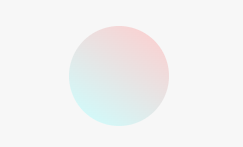

# Entry 4
##### 2/24/25

## Content
The tool that I chose to use after tinkering with the different choices of tools was **animation**. In the beginning I tried to do A-frame and tinkered with it on my ide but I found out that it was challenging and hard to understand. So testing out my other options that I chose out of my three I found one that I was comfortable with and when I tinkered with it. This tool was just perfect for me because it was not too easy and not too hard for me. Websites that I used to learn and tinker with was [animate.css](https://animate.style/), [pickcode](https://app.pickcode.io/project/cm7qtmnmun5h0emhdxs2rt1y0) and also **free code camp** lessons. 

----
I tinkered with animate the css by changing around the numbers for things like the ```animation-iteration-count``` and the ```animation-duration``` by testing and trying out different numbers. The beginning code looked like 

```CSS
 .ball {
    width: 100px;
    height: 100px;
    margin: 50px auto;
    position: relative;
    border-radius: 100%;
    background: linear-gradient(
      35deg,
      #ccffff,
      #ffcccc
    );
    animation-name: bounce;
    animation-duration: 2s;
    animation-iteration-count: 3s;
  }

  @keyframes bounce{
    0% {
      top: 0px;
    }
    50% {
      top: 249px;
      width: 130px;
      height: 70px;
    }
    100% {
      top: 0px;
    }
  }
```


---

This part was the original code and after changing some code around on pickcode to check how the code would change when I alter things and adding some new code that I learned from free code camp lessons this is what it looked like 

```CSS
.ball {
    width: 100px;
    height: 100px;
    margin: 50px auto;
    position: relative;
    border-radius: 5%;
    background: linear-gradient(
      35deg,
      #ccffff,
      #ffcccc
    );
    animation-name: bounce;
    animation-duration: 0.5s;
    animation-iteration-count: infinite;
  }
```

---

I changed the border radius animation duration and iteration. After altering the radius the shape turned from a circle to a sort of square and when it bounces it goes to a rectangle, the iteration count I changed the three second to infinite which is what I learned on free code camp lessons. This made it so that the animation would play an infinite amount of times. The last thing I changed around was the animation duration, in the beginning I thought it was too slow so I changed it to a faster speed using 0.5s instead of three seconds. 


--- 

Another part that I changed from the original code was the keyframes. At first I did not know what they really were but by changing the numbers around I was able to figure out what the keyframes do. This is what the code for the keyframes look like after I changed the numbers inside the keyframe. 

```CSS
@keyframes bounce{
    0% {
      top: 70px;
    }
    50% {
      top: 20px;
      width: 10px;
      height: 2px;
      transform: scale(0.5);
    }
    100% {
      top: 10px;
      opacity: 0.5;
    }
  }
```
Adding the transform and the opacity sort of made the object have a different animation. The square starts from a big square and sort of vanishes so you can't see it and reappears. 

---

## Skills

### Time Management 
I am able to balance my time and do things like homework that I am assigned, even on a busy schedule. Right now I take prep classes for the sat and also do some volunteering outside of school. Even with this tight schedule I make good use of my time and manage it well. I make sure that I still have time to do homework, study for tests and put some time to work on other big things like the freedom project and others. I created a schedule and developed a sort of habit and routine. Everyday when I come home I just follow this and I end up with some time to do work or give myself a little rest from work. I mark everything that is important and that is a priority and do it first before doing any other work.  

### Embracing failure
When doing coding or anything and even in sports failure has always been a major setback in my life. Losing basketball games and not understanding the code, ending up getting the whole code wrong. But I have come to learning and understanding that failure is good and its normal for everyone. Failing dosen't mean that you're bad at anything. It's just another way of saying to not give up and to try again no matter how many times you fail. Each time in basketball my team lost, we always tried to figure out why we lost and to improve the next time, working harder to get better. Each time it worked and even though we were not winning we saw results and progress of us getting better. During coding lessons also, not understanding the code and getting the whole assignment wrong, but after practice and taking time to understand I finally understood the topic and improving through my failures. In the end I found out failure leads to success in a way if you use that failure to learn.  


