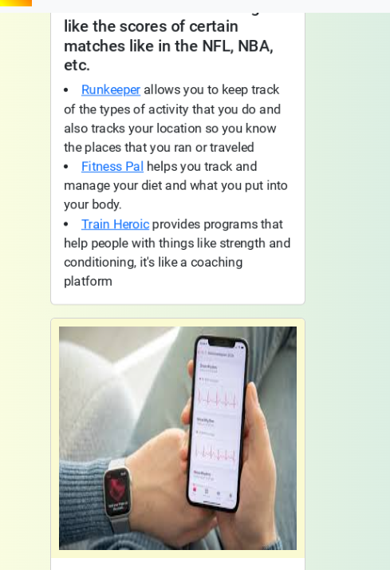
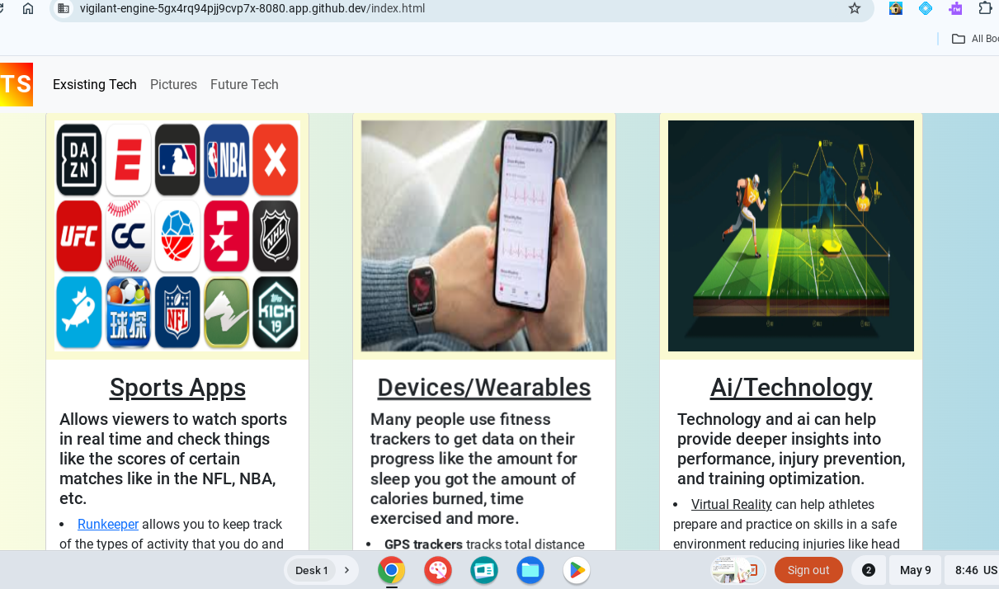

# Entry 6
## 5/9/25

# Content
 From my last blog entry where I started learning my tool animation and gathering everything that I needed to make my freedom project. I have currently made a MVP(Minimum Viable Prodcut) for my project and it started off in the beginning by planning out what my website would look like and I did that by creating wireframes. I created two seperate wireframes one which was a layout of what my website would look like on my phone, [mobile Wireframe](mobile-wireframe.png) and another which was my [Computer Wireframe](Computer-Wireframe.png) which was what the layout of my website would look like on a computer, different viewpoerts. I started working on my MVP and now I have a mostly everything that I need done for my website. I created my code by appplying all that I know about this class and what I learned on my own including things like `containers,` `container fluids`, lessons on my tool animation. An important tool or material that I used was my [sep Notes](https://docs.google.com/document/d/1n9YZLqsv50YrUhVFN-iwL44YH_rncWpJEAocTKbw2i0/edit?tab=t.0) which helped me a lot to remmeber all the past code that we have done and I forgot about and holding my information forboth par ta nad b of my website. By utilizing all my materials that i learned about animation I was able to apply it to my website thanks to helpful tools and notes that I took on my learning log. For some of the animation code I looked on [Animation.css](https://animate.style) which helped me to apply my took into my website.


# Challenges
 One challenge that I faced when working on my MVP was with the [getbootstrap website](https://getbootstrap.com). When I was working with my first carousel and putting the pictures into the carousel code, when I tried to click it didnt let me and the pictures werent really showing either. After taking another closer look I found out the reason taht my code for the carousel wasnt working was because I did not import the carousel code from the correct bootstrap version. Instead of using the version 5.3 which was the updated one I was using 5.2. the codes or the two of them were very different in length. For the v2.3 one it looked like this

```html
<div id="carouselExampleSlidesOnly" class="carousel slide" data-bs-ride="carousel">
  <div class="carousel-inner">
    <div class="carousel-item active">
      
    </div>
    <div class="carousel-item">
      
    </div>
    <div class="carousel-item">
      
    </div>
  </div>
</div>
```
and for the version 5.3 which is the newer version it looked like this

```html
<div id="carouselExample" class="carousel slide">
  <div class="carousel-inner">
    <div class="carousel-item active">
      
    </div>
    <div class="carousel-item">
      
    </div>
    <div class="carousel-item">
      
    </div>
  </div>
  <button class="carousel-control-prev" type="button" data-bs-target="#carouselExample" data-bs-slide="prev">
    <span class="carousel-control-prev-icon" aria-hidden="true"></span>
    <span class="visually-hidden">Previous</span>
  </button>
  <button class="carousel-control-next" type="button" data-bs-target="#carouselExample" data-bs-slide="next">
    <span class="carousel-control-next-icon" aria-hidden="true"></span>
    <span class="visually-hidden">Next</span>
  </button>
</div>
```
 The code for the 5.3 looked a lot more different and I made this mistake back then but I did it again, this time I made sure to remind myself whenever I do another project and put it in bold inside my notes.

 Another challenge that i had was trying to get the cards in my website to be in the same line or next to one another. I tried to use `container` becasue I thought that it would put the cards together right next to one another but it didnt. Instead it just stacked the cards one on the top and one on the bottom which was not what I wanted. In the beginning it looked like this...



---

 My cards were just basically in a vertical straigt line which is not what I wanted. I wanted to get the cards so they were right next to each other. So I started to ask a few of my friends for help and they said to use `<div class="row">` I applied this into my code and it this is the results that it gave me.



---

 By adding that the div class row it put everything alligned in a row to what I wanted and made my website for the cards look better. My friends were a really important tool in this project also, helping me through challenges and problems with my code.

# Engineering Design Process
 Right now in the engineering design process I  just finished creating my prototype step fiec and im on step six to seven right now which is just testing out the product and getting feedback on it. With the valuable feedback from my peers on my website. I am currently taking some of their suggestions and using that to improve some of the flaws inside my website adding on to the website that I have built so far.

# Skills

---

## Time managment
 As of right now it has been a little difficult for me to manage my time due to studying for the ap classes and the load of work from school and some classes that I have outside of school for SAT prep. I started to manage my time by creating a different type of schedule that was different from my last one, this included doing all of the hard work first and saving the easy ones for last. This method helped me save more time and got things done faster for me. With the remaning time I began to utlize my time and spend some on studying for upcoming test and ap tests. The time that was left I started to dedicate to creating more of my freedom project and tacklking the project little to little untill it was done, chipping away piece by piece.

 ## Perserverance/Not giving up
 When I could not find out why the code was broken and when everyone had a website that was fully complete and done I started to panic in a way because it was hard for me to ask for help because I didn't want to distrub people why they were doing there code which. This led me in a state where I wanted to give up and just get a 0 on my freedom project. But after convincing myself not to give up because having a wesbite that had some flaws or a lot of flaws was better than not having a project. So this inspired me to not give up and to keep going which allowed me to complete the freedom project and catch up with everyone else. This also helped apply to basketball when I would lose a game agaisnt my brother which made me super angry, but I only took that loss and turned it into a lesson and didnt give up so that the next time when I faced him I would beat him. 

[Previous](entry05.md) | [Next](entry07.md)

[Home](../README.md)
